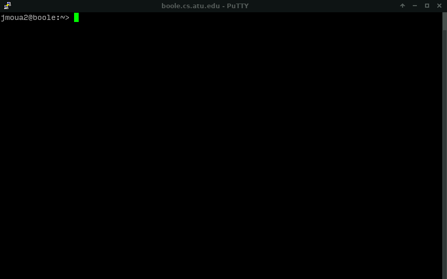
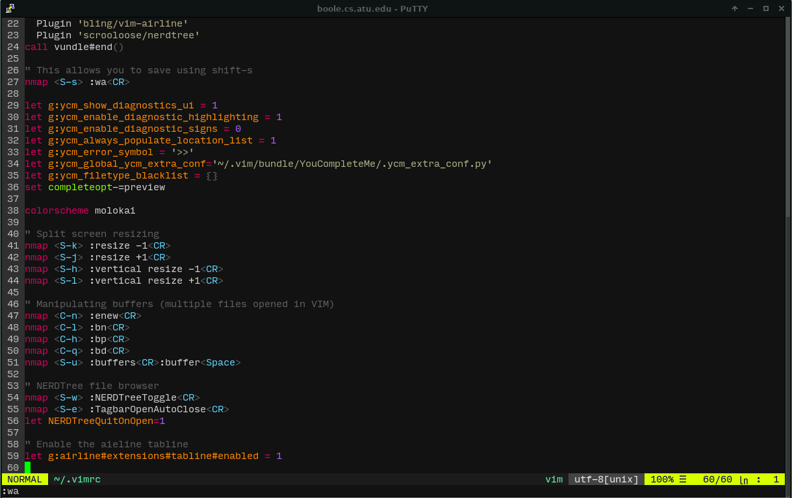
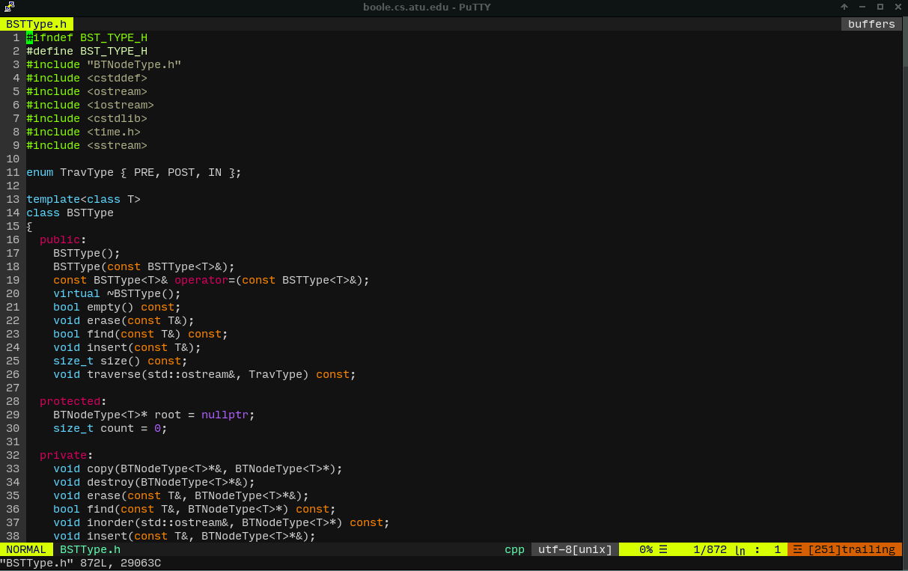
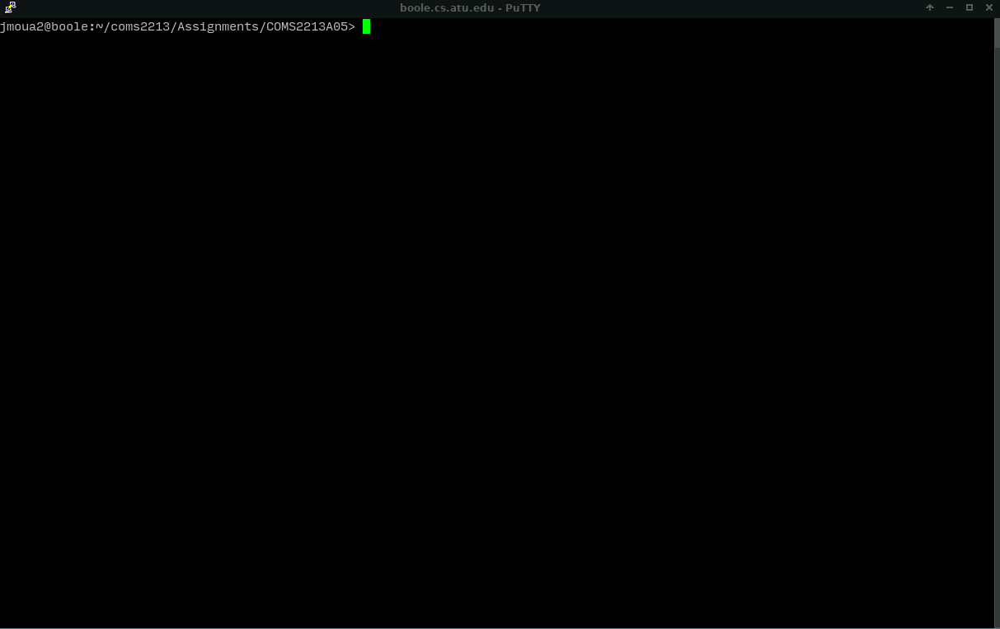
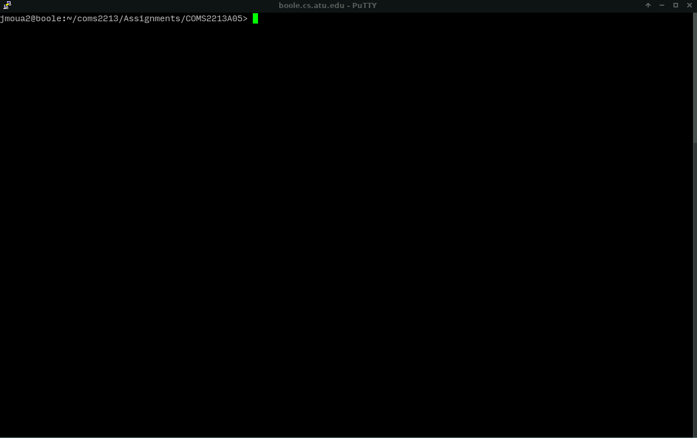
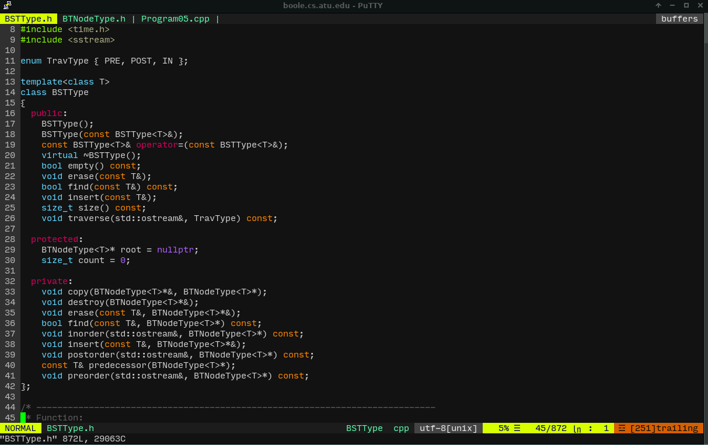
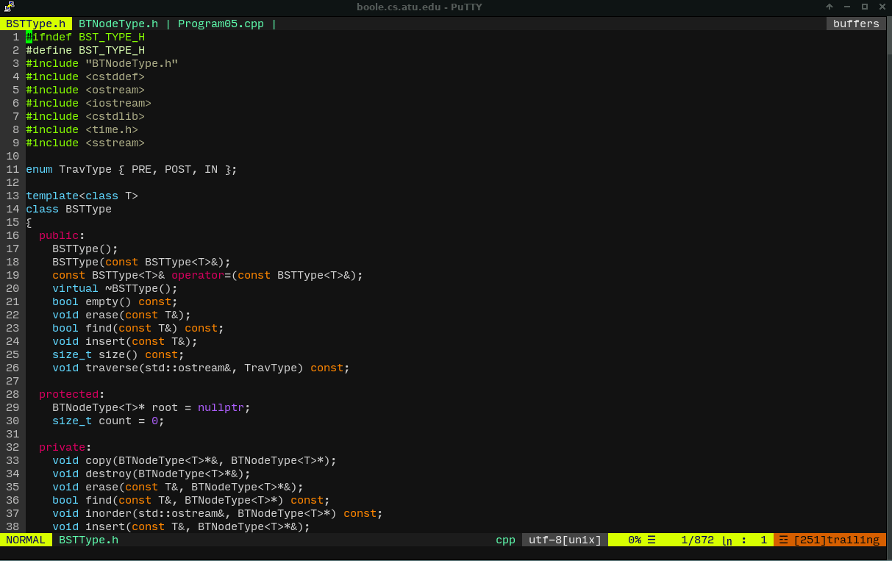

## Introduction

You can have a nice workflow in VIM just like you can in an IDE.

## Step 1
To get
started, install these three plugins into your VIM config file.

1. `majutsushi/tagbar`
2. `bling/vim-airline`
3. `scrooloose/nerdtree`



## Step 2

Append these settings below into your VIM configuration file. Either copy and
paste them or manually type them.

```
" Useful VIM bindings
nmap <S-k> :resize -1<CR>
nmap <S-j> :resize +1<CR>
nmap <S-h> :vertical resize -1<CR>
nmap <S-l> :vertical resize +1<CR>

" For manipulating buffers (or multiple files in VIM)
nmap <C-n> :enew<CR>
nmap <C-l> :bn<CR>
nmap <C-h> :bp<CR>
nmap <C-q> :bd<CR>
nmap <S-u> :buffers<CR>:buffer<Space>

" NERDTree
nmap <S-w> :NERDTreeToggle<CR>
nmap <S-e> :TagbarOpenAutoClose<CR>
let NERDTreeQuitOnOpen=1


" Enable the airline tabline
let g:airline#extensions#tabline#enabled = 1
```



# Working With Split Screens

VIM is capable of split screens so you can look at code from the same source
file or different source files.

`:sp` will split the VIM window horizontally.


`:vsp` will split the VIM window vertically.

Once you have split screens, you can press `ctrl-w-w` to switch between them.

Let's take a look:





# Working with Multiple Files

You can open multiple files in VIM by feeding in more than one file in the
command line. The other files will be displayed on the top extensions air that
we enabled.

You can move between these files using `shift-h` and `shift-l`.



### Using the NERDTree or Buffers shortcut

Since we've bind `Shift-w` to open the NERDTree, we can press that shortcut and
navigate files using that. We can also press `Shift-u` to see our opened
buffers, and tab cycle through them or type a filename.



### Locating members and functions via the TagBar

`shift-e` will open the TagBar. To close out of it, we either select target
from the list to go to it, or we can type the VIM command `:q`. This TagBar is
useful when wanting to find functions or classes in a big file.


