# Getting autocompletion on VIM

VIM can be customized on the Boole server. To do so, you need to have a plugin
manager for VIM or you can manually manage plugins yourself, but that can be
quite a headache. There are various plugin managers for VIM, but `Vundle` is
the one that we are going to use for this tutorial.

The actual autocompletion plugin we'll be using is Valloric's YouCompleteMe,
which can be found [here](https://github.com/ycm-core/YouCompleteMe).

## Step 1

Clone the plugin manager `Vundle` into your vim directory with the follow
command.

```
git clone https://github.com/VundleVim/Vundle.vim.git ~/.vim/bundle/Vundle.vim
```

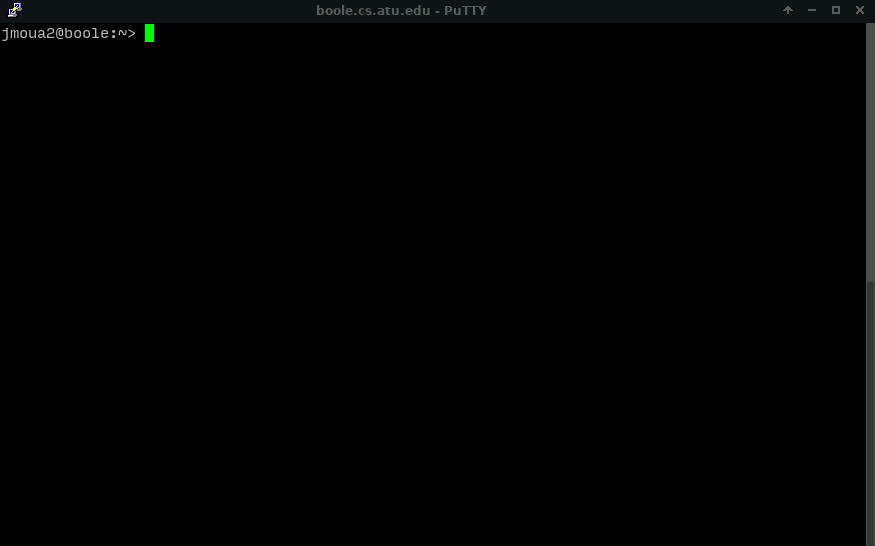

## Step 2

Clone my provided basic vim config file from the following command

```
wget raw.githubusercontent.com/jimmoua/boole/master/.vimrc --output-document ~/.vimrc
```

**THIS WILL OVERWRITE YOUR CURRENT VIM CONFIGS**. If you do not wish to
overwrite your current VIM configurations, follow the guide on how to install
Vundle
[here](https://github.com/VundleVim/Vundle.vim)


## Step 3

**Install the plugins** by typing the following on the shell.

```
vim +PluginInstall +qall
```

**This will bring you inside a VIM window**. Just let it install and it will
take you back to the shell once it is finished. **YouCompleteMe** will take
roughly 30 or so seconds to install, so wait for it.

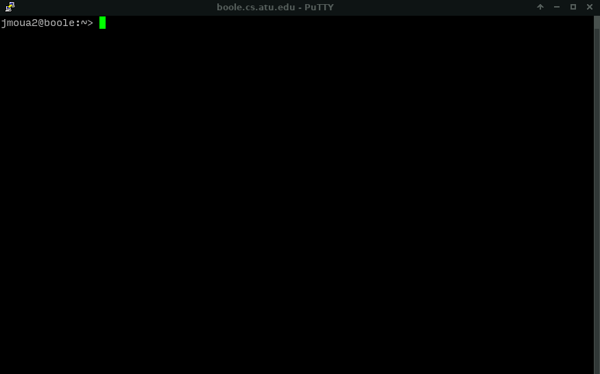

## Step 4

Change directory to the plugin `YouCompleteMe`.

```
cd ~/.vim/bundle/YouCompleteMe/
```


In the `YouCompleteMe` directory, Install the python script by typing the below

```
./install.py --clang-completer
```

**Note that this may be a bit lengthy because completion system has to compile
a bunch of stuff**. Wait for it to complete. You can see the GIF below, it's
around 2 minutes long.

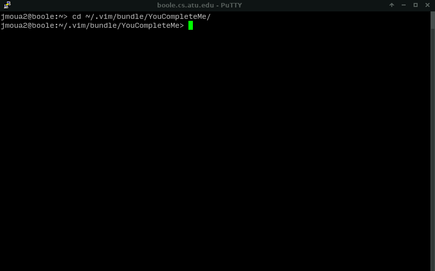


## Step 5

Still inside your `YouCompleteMe` folder, delete the file `.ycm_extra_conf.py`.
If you get prompted to confirm, just type yes.

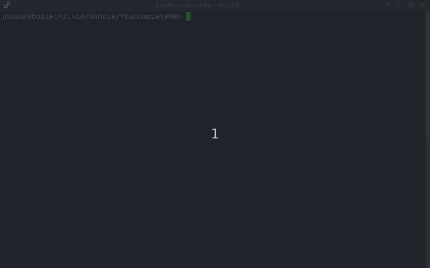

## Step 6

You'll want to down a file from my repository. This is just a template file I
found online, and it's very useful for Valloric's plugin. Type the following
command (make sure you're still in the `YouCompleteMe` directory).

```
wget https://raw.githubusercontent.com/jimmoua/boole/master/.ycm_extra_conf.py
```

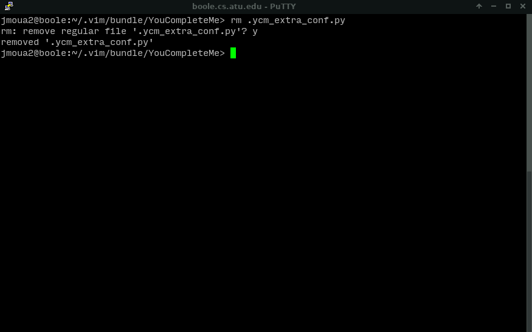

## Step 7

In a window, type `gcc -xc++ -E -v -`. This will give you the include path for
C++ libraries. Copy them or manually type them into the YCM config file in the
`BASE_FLAGS` area like I did in the GIF. **Each directory must be the exact
path, so no typos**.

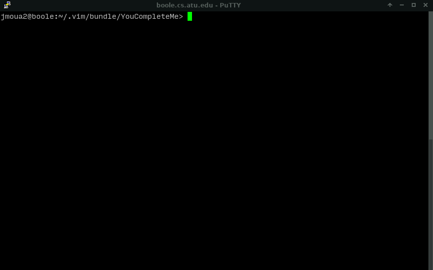

**Copy those paths and put them between the** `BASE_FLAGS` **in the**
`.ycm_extra_conf.py` **like below**.

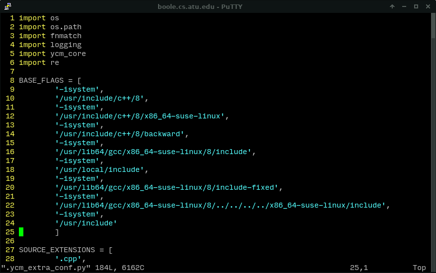

Each of these paths will need an `-isystem` above it (refer to the image). It
will take on the follow form:

```
BASE_FLAGS = [
        '-isystem',
        'path',
        '-isystem',
        'path',
        '-isystem',
        'path',
        '-isystem',
        'path'
        ]
```

**This also means every time the C++ standard commitee updates C++ language,
and whoever is in charge of managing the Boole server also decides to do an
upgrade, you'll have to change these paths for autocompletion to work**.


**Do the following so you don't get errors in your header files when working
with C++**. Just add these to the top of `BASE_FLAGS`

```
'-std=c++11',
'-xc++'
```

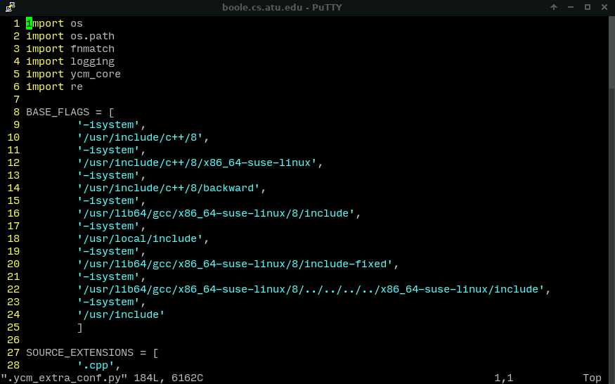

## Step 8

**I strongly recommend that you use the a different color scheme instead of the
default colorscheme**. Some errors are red, and the default color scheme will
make them hard to read.

Just add `colorscheme {some color scheme}` to your `.vimrc` file. Examples
below.


## Getting more color schemes

Before we get started with colors, PuTTY doesn't really do much colors. To do
this, we need to make sure that our terminal environment is set up to support
256 colors. Find this out by typing `echo $TERM`.

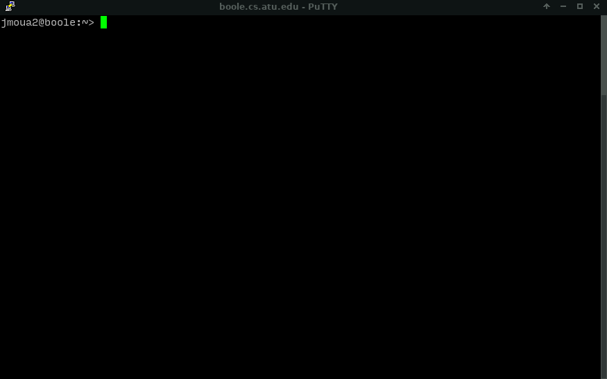

If it echos back just `xterm`, we have to set it to something that supports
more colors: `xterm-256color`. Configure your BASH or whichever shell you're
using to use the 256 color mode for xterm. (By default, all Boole users are set
to use the BASH environment).

**If your BASH configuration file is empty or doesn't exist, do not worry about
it**. All you need to do is have a `.bashrc` and add the lines
`export TERM=xterm-256color` to it.

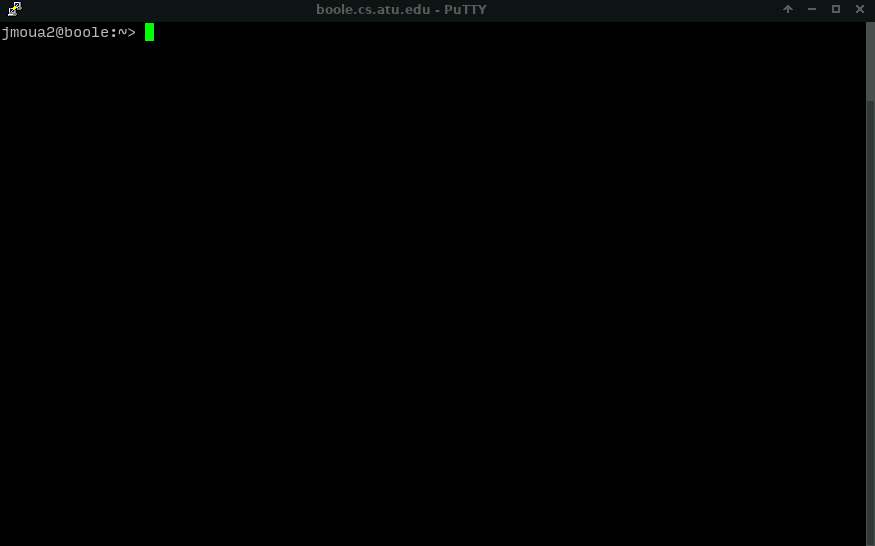

Either restart your SSH client, or type into BASH or whatever shell you're
using `export TERM=xterm-256color`.


### Getting Color Schemes

The default colors schemes that VIM provides aren't really much, so we can get
more from a plugin.

Add the following plugin to your VIM plugins:

```
Plugin 'rafi/awesome-vim-colorschemes'
```
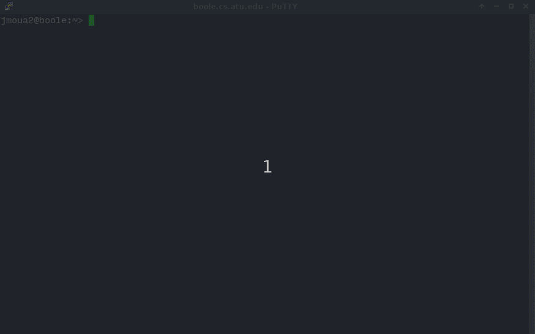

## Setting a colorscheme

Browse through the colorschemes by playing on VIM first. This can be done from
the command in VIM `:colorscheme `. Press tab to cycle through the color
schemes, see which one you like, and set it to your VIM configuration file.

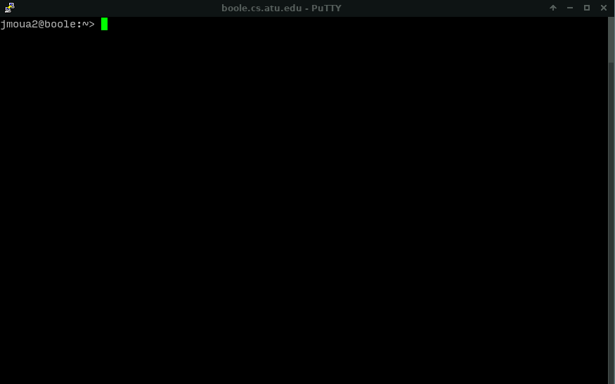

We can then change the color scheme setting in the VIM configuration file as
done below:

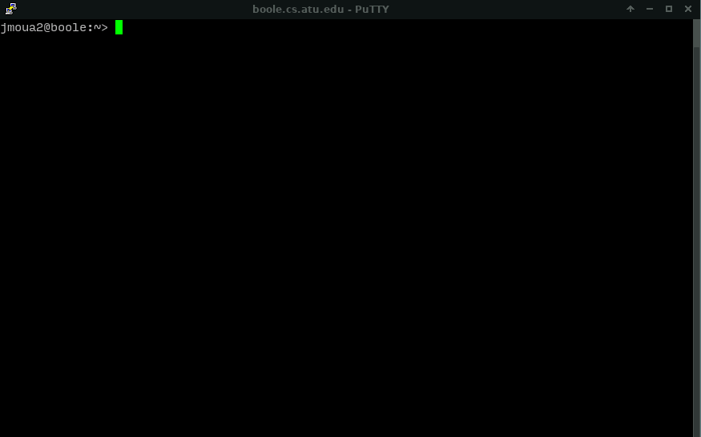

## Final Product Showcase

For this example, I went with molokai color scheme. There are tons of color
schemes to choose from, so explore. **Important to know that some color schemes
just will not display as good as others**.

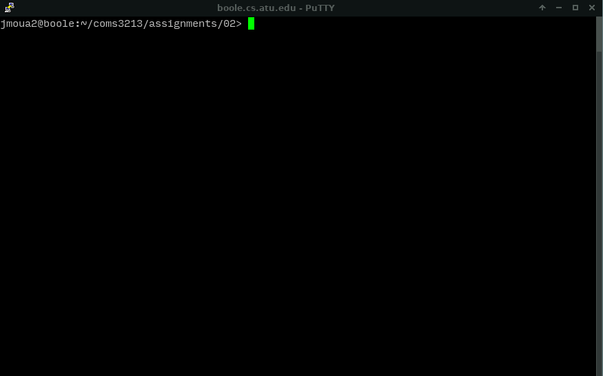
