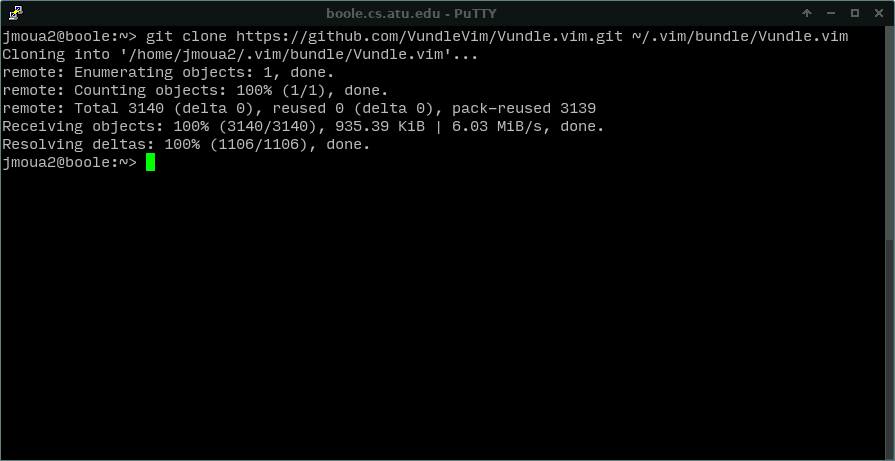
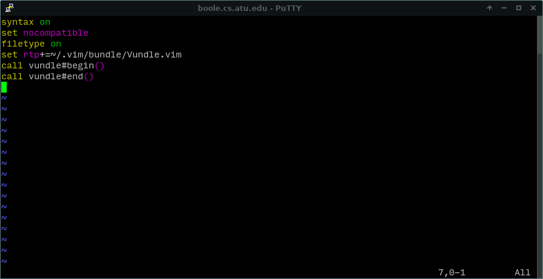
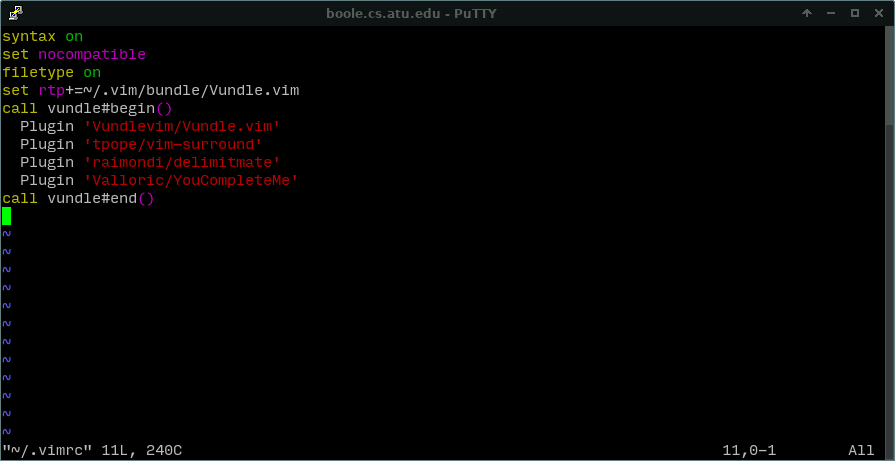
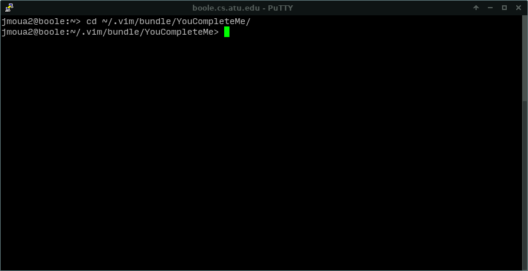
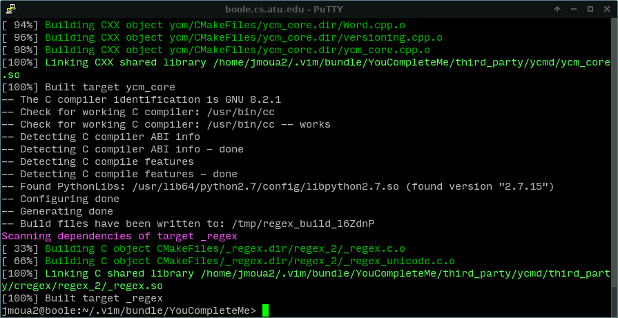
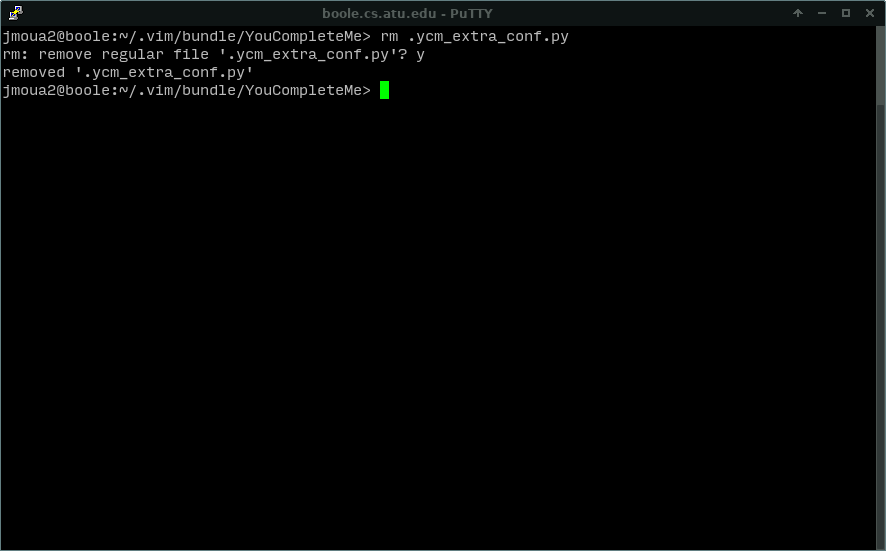
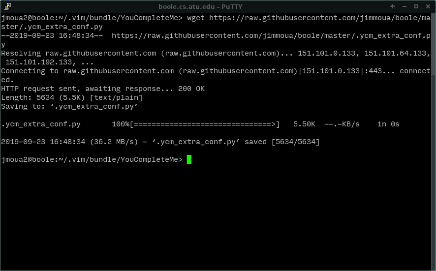
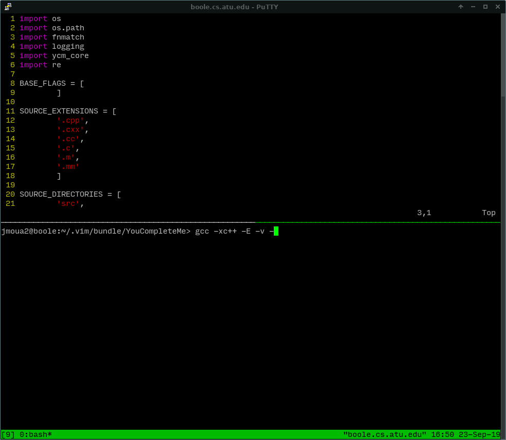

# Getting autocompletion on VIM

VIM can be customized on the Boole server. To do so, you need to have a plugin
manager for VIM or you can manually manage plugins yourself, but that can be
quite a headache. There are various plugin managers for VIM, but `Vundle` is
the one that we are going to use for this tutorial.

The actual autocompletion plugin we'll be using is Valloric's YouCompleteMe,
which can be found [here](https://github.com/ycm-core/YouCompleteMe).

## Step 1

Clone the plugin manager `Vundle` into your vim directory with the follow
command.

```
git clone https://github.com/VundleVim/Vundle.vim.git ~/.vim/bundle/Vundle.vim
```



## Step 2

**Or you can go to step 6 and copy-paste that .vimrc file, then skip to step
4**.


Edit your `.vimrc`. This is usually found in your home directory which is
indicated by `~/`.

Type in
```
vim ~/.vimrc
```

By default, it should be blank. If not, don't worry.

Append the following lines to your `.vimrc`.

```
set nocompatible
filetype off
set rtp+=~/.vim/bundle/Vundle.vim
call vundle#begin()
call vundle#end()
```

The lines above are required as per the guide found [here](https://github.com/VundleVim/Vundle.vim)



## Step 3

Keep your `.vimrc` opened. As you may have guessed, the plugins that we will
install go between the `call vundle#begin()` and `call vundle#end()`.

Between these two, add the following lines

```
Plugin 'Vundlevim/Vundle.vim'
Plugin 'tpope/vim-surround'
Plugin 'Valloric/YouCompleteMe'
```

The config file should now look like:



**Note that you do not have to indent. I just do it to make it look tidy**.

`Vundlevim` is the required plugin. It is a required one in the VIM config
file. `delimitmate` is another plugin that automatically adds a second bracket
or parenthesis when you type an opening one. It is optional to have it, but I
have included it just in case you want it. You can remove it if you want. The
same goes with `vim-surround`.

## Step 4

Save and close out of VIM. **Now install the plugins** by typing the following
on the shell.

```
vim +PluginInstall +qall
```

**This will bring you inside a VIM window**. Just let it install and it will
take you back to the shell once it is finished.

## Step 5

Change directory to the plugin `YouCompleteMe`.

```
cd ~/.vim/bundle/YouCompleteMe/
```



In the `YouCompleteMe` directory, Install the python script by typing the below

```
./install.py --clang-completer
```

**Note that this may be a bit lengthy because completion system has to compile
a bunch of stuff**. Wait for it to complete.

Once it has finished, your SSH client screen should look something like this:



## Step 6

Go back and edit your `~/.vimrc`.

Either copy this file, or just add what you like. If you're not sure what
something does, Google it (though I strongly recommend this configuration file).

To copy, type
```
wget https://raw.githubusercontent.com/jimmoua/boole/master/.vimrc --output-document ~/.vimrc
```

Or copy and paste the below. (Probably better to `wget` since SSH clients are
buggy when it comes to copy and paste).

```
set expandtab
set tabstop=2
set softtabstop=2
set shiftwidth=2
set autoindent
set breakindent
set backspace=2
set wildmenu
set number
syntax on
set nocompatible
filetype on
filetype plugin indent on
set rtp+=~/.vim/bundle/Vundle.vim
call vundle#begin()
  Plugin 'Vundlevim/Vundle.vim'
  Plugin 'tpope/vim-surround'
  Plugin 'raimondi/delimitmate'
  Plugin 'Valloric/YouCompleteMe'
call vundle#end()

" This allows you to save using shift-s
nmap <S-s> :wa<CR>

let g:ycm_show_diagnostics_ui = 1
let g:ycm_enable_diagnostic_highlighting = 1
let g:ycm_enable_diagnostic_signs = 0
let g:ycm_always_populate_location_list = 1
let g:ycm_error_symbol = '>>'
let g:ycm_global_ycm_extra_conf='~/.vim/bundle/YouCompleteMe/.ycm_extra_conf.py'
let g:ycm_filetype_blacklist = {}
```

**I would just copy-paste the whole thing**. These are what I find very
essential to using a customized VIM efficiently.

## Step 7

Still inside your `YouCompleteMe` folder, delete the file `.ycm_extra_conf.py`.
If you get prompted to confirm, just type yes.



## Step 8

You'll want to down a file from my repository. This is just a template file I
found online, and it's very useful for Valloric's plugin. Type the following
command (make sure you're still in the `YouCompleteMe` directory).

```
wget https://raw.githubusercontent.com/jimmoua/boole/master/.ycm_extra_conf.py
```



## Step 9

Open the `.ycm_extra_conf.py`. You'll want to have a screen multiplexer opened
for this **or** another instance of your SSH client (PuTTY for example).
Basically, you want two windows so you can refer to the other while typing in
the path of the C++ libraries.

In a window, type `gcc -xc++ -E -v -` and on the other, have the YCM config
file up.



## Step 10

This is perhaps the most important step? Once you've typed in the `gcc`
command, it will show the library path for C++ on the Boole system. This begins
where it says `#include <...> search starts here:`.

**Copy those paths and put them between the** `BASE_FLAGS` **in the**
`.ycm_extra_conf.py` **like below**.


Each of these paths will need an `-isystem` above it (refer to the image). It
will take on the follow form:

```
BASE_FLAGS = [
        '-isystem',
        'include path',
        '-isystem',
        'include path',
        '-isystem',
        'include path',
        '-isystem',
        'include path'
        ]
```

**This also means everything the C++ standard commitee updates C++ language,
and whoever is in charge of managing the Boole server also decides to do an
upgrade, you'll have to change these paths for autocompletion to work**.

## Step 11

Close out of the YCM config file. You can close out of the `gcc` command window
by pressing `CTRL-c`.

## Step 12

Enjoy.

**I strongly recommend that you use the industry color scheme instead of the
normal colorscheme**. Some errors are red, and the default color scheme will
make them unreadable.

Just add `colorscheme industry` to your `.vimrc` file.


